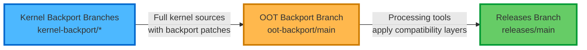

# xekmd-backports

Repository for Intel® Graphics Driver (Xe KMD) backports and development branches.

## Overview

This repository contains multiple branches for Intel® Graphics Driver (Xe) backports targeting different kernel versions. The repository is structured to support kernel backports, out-of-tree (OOT) builds, and release management.

## Repository Structure

### Workflow Overview

The repository follows a three-stage workflow:

1. **Kernel Backport Branches** (`kernel-backport/*`) - Generate full kernel sources with Intel® Graphics Driver (Xe) backport patches applied to specific kernel versions. These branches contain in-tree patches and can be used for complete kernel builds.

2. **OOT Backport Branch** (`oot-backport/main`) - Contains tools that process kernel-backport branches and extract information to generate out-of-tree (OOT) source code. These tools apply compatibility layers, DKMS support, and build configurations to create standalone driver source code that is published to the releases branch.

3. **Releases Branch** (`releases/main`) - Contains the generated source code for out-of-tree xe module and other required modules. End users can use this source code to build and install the OOT modules via DKMS on their systems.

**Flow:** kernel-backport (full kernel) → oot-backport (processing tools) → releases (OOT source code)



### Branches
| Kernel Backport Branches | OOT Backport Branch | Release Branch |
|---------------------------|---------------------|----------------|
| **[kernel-backport/main](https://github.com/intel-gpu/xekmd-backports/tree/kernel-backport/main)** ([README](https://github.com/intel-gpu/xekmd-backports/blob/kernel-backport/main/README.md)) <br> *Status:* **Active** (Recommended) <br> *Kernel:* v7.0+ <br> *Description:* Primary backport branch with in-tree patches. Latest features: EU debugging. Can be used for full kernel builds |Under Development|Under Development|
| **[kernel-backport/v6.17](https://github.com/intel-gpu/xekmd-backports/tree/kernel-backport/main)** ([README](https://github.com/intel-gpu/xekmd-backports/blob/kernel-backport/v6.17/README.md)) <br> *Status:* **Active** (Recommended) <br> *Kernel:* v6.17+ <br> *Description:* In-tree backport patches. Latest features: PMU, hwmon, SR-IOV, EU debugging, Xe2 HPG. Can be used for full kernel builds |**[oot-backport/main](https://github.com/intel-gpu/xekmd-backports/tree/oot-backport/main)** ([README](https://github.com/intel-gpu/xekmd-backports/blob/oot-backport/main/README.md)) <br><br> *Status:* **Active** <br><br> *Description:* Contains tools that process kernel-backport branches to generate OOT source code with compatibility layers, DKMS support, and build configurations for releases branch | **[releases/main](https://github.com/intel-gpu/xekmd-backports/tree/releases/main)** ([README](https://github.com/intel-gpu/xekmd-backports/blob/releases/main/README.md)) <br><br> *Status:* **Active** <br><br> *Description:* Out-of-tree source code for xe and other required modules. End users can build and install DKMS modules from this source <br><br>  $\color{red}{LIMITATION: \space Display \space is \space not \space supported \space with \space DKMS \space releases}$ |
| **[kernel-backport/v6.14](https://github.com/intel-gpu/xekmd-backports/tree/kernel-backport/v6.14)** ([README](https://github.com/intel-gpu/xekmd-backports/blob/kernel-backport/v6.14/README.md)) <br> *Status:* **Frozen** <br> *Kernel:* v6.14 <br> *Description:* In-tree backport patches. SR-IOV backports from v6.14-v6.17, VFIO migration support. No longer receiving updates | | |
| **[kernel-backport/v6.11](https://github.com/intel-gpu/xekmd-backports/tree/kernel-backport/v6.11)** ([README](https://github.com/intel-gpu/xekmd-backports/blob/kernel-backport/v6.11/README.md)) <br> *Status:* **Frozen** <br> *Kernel:* v6.11 <br> *Description:* In-tree backport patches. No longer receiving updates | | |

**Management Branch:** [master](https://github.com/intel-gpu/xekmd-backports/tree/master) - Repository management, documentation, setup scripts, and contribution guidelines

#### Target Kernel Branches

These branches are similar to kernel-backport but are intended for use along with releases/main branch. They contain a list of patches which need to be picked up into the base kernel in order to fully enable certain features on Xe or related modules. For example: VFIO core driver changes required for Xe VFIO functionality. Alternatively, these can be used as a base kernel on top of which DKMS can be installed.

| Branch | Status | Kernel Version | Description |
|--------|--------|----------------|-------------|
| **[target-kernel/v6.6](https://github.com/intel-gpu/xekmd-backports/tree/target-kernel/v6.6)** ([README](https://github.com/intel-gpu/xekmd-backports/blob/target-kernel/v6.6/README.md)) | **Active** | v6.6 | Base kernel v6.6 with backport patches required for enabling Xe features. Contains patches for VFIO core and other required subsystems |

**Note:** See each branch's README for detailed information and instructions.

## Quick Start

### Using Git Worktrees (Recommended)

Git worktrees allow you to check out multiple branches simultaneously in separate directories, enabling parallel work across different branches without switching contexts. This is particularly useful for this repository's workflow, where you may need to work on kernel-backport, oot-backport, and releases branches concurrently, test changes across the pipeline, or compare outputs between stages.

The repository includes a `setup-worktree.sh` script to manage multiple branches efficiently:

#### Create all worktrees (kernel-backport, oot-backport, releases)

Sets up separate directories for each branch in the workflow pipeline, allowing you to work on all branches concurrently.

```bash
$ ./setup-worktree.sh create-worktree
```

After running `create-worktree`, you'll have:
- `kernel-backport/` - Working directory for kernel-backport/main (input branch)
- `oot-backport/` - Working directory for oot-backport/main (processing branch)
- `releases/` - Working directory for releases/main (output branch)

#### Create only kernel-backport worktree and generate base kernel

Sets up just the kernel-backport branch directory and generates the full kernel source tree. Useful when you only need to work on kernel backport patches.

```bash
$ ./setup-worktree.sh kernel-backport-only
```

#### Create only releases worktree

Sets up just the releases branch directory for working with OOT module source code. Useful for testing DKMS builds or making changes to the final release output.

```bash
$ ./setup-worktree.sh oot-release-only
```

#### List current worktrees

Displays all active worktrees and their associated branches.

```bash
$ ./setup-worktree.sh list-worktree
```

#### Clean up all worktrees

Removes all worktree directories while preserving the main repository.

```bash
$ ./setup-worktree.sh clean-worktree
```

### Manual Branch Checkout

To check out a specific branch, use the standard git checkout command:

```bash
git checkout <branch-name>

# Example:
$ git checkout kernel-backport/main
```

**Note:** See the [Branches](#branches) section above for available branch names, their purposes, and recommended branches for your use case.

## Contributing

Please read [CONTRIBUTING.md](CONTRIBUTING.md) for details on our contribution process and code of conduct.

All contributions must be signed off according to the Developer Certificate of Origin (DCO). Add a sign-off line to your commits:

```bash
git commit -s -m "Your commit message"
```

## License

This work is a subset of the Linux kernel and follows the kernel's licensing. See individual files for specific copyright and license information. The kernel is licensed under GPL-2.0.

## Support and Community

- **Security Issues**: See [SECURITY.md](SECURITY.md)
- **Code of Conduct**: See [CODE_OF_CONDUCT.md](CODE_OF_CONDUCT.md)

---
