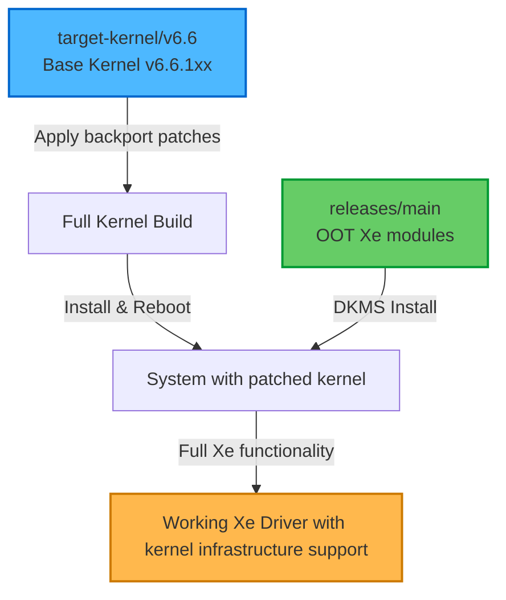

# Target Kernel v6.6 - Base Kernel Backports

This branch provides backport patches for Linux kernel v6.6 targeting core kernel subsystems (VFIO, PCI, IOMMU, etc.) required by Intel® Xe Graphics Driver. These patches enable advanced features when used with [releases/main](https://github.com/intel-gpu/xekmd-backports/tree/releases/main) DKMS modules.

**Scope:** Only non-DRM/non-Xe kernel components. All graphics driver patches belong in [kernel-backport](https://github.com/intel-gpu/xekmd-backports/tree/kernel-backport/main) branches.

## Branch Information

- **Branch:** `target-kernel/v6.6`
- **Base Kernel:** v6.6.x
- **Status:** Active

## Use Cases

This branch can be used in two ways:

### 1. As a Base Kernel with DKMS
Build a full kernel from this branch and install it on your system, then install the DKMS modules from [releases/main](https://github.com/intel-gpu/xekmd-backports/tree/releases/main) on top of it.

### 2. As a Patch Source
Extract the patches from this branch and apply them to your existing kernel build to enable Xe features.

## Patches Included

Patches may target various kernel subsystems, For Example:
- **VFIO** - Virtualization support, SR-IOV, device passthrough
- **PCI** - PCIe features, power management, AER handling
- **DMA-BUF** - Buffer sharing infrastructure
- **Power Management** - Runtime PM, suspend/resume
- **IRQ/MSI** - Interrupt handling

**Note:** Check the `series` file for the current patch list.

## Building the Kernel

### Prerequisites
- Standard kernel build tools (gcc, make, etc.)
- bc, flex, bison
- libelf-dev, libssl-dev

### Build Steps

1. **Clone the repository and checkout this branch:**
   ```bash
   git clone https://github.com/intel-gpu/xekmd-backports.git
   cd xekmd-backports
   git checkout target-kernel/v6.6
   ```

2. **Create the kernel tree with patches applied:**
   ```bash
   ./backport.sh --create-tree
   ```
   
   This will:
   - Download the baseline kernel (v6.6.1xx)
   - Extract the kernel source
   - Apply all patches from the `series` file

3. **Configure the kernel:**
   ```bash
   cd linux-6.6.1xx
   make menuconfig
   # Or copy your existing config:
   # cp /boot/config-$(uname -r) .config
   # make olddefconfig
   ```
   
   Ensure relevant kernel options are enabled based on the features you need. For example, if VFIO patches are included:
   - `CONFIG_VFIO=y` or `CONFIG_VFIO=m`
   - `CONFIG_VFIO_PCI=y` or `CONFIG_VFIO_PCI=m`
   - `CONFIG_IOMMU_SUPPORT=y`
   
   **Note:** Do not enable `CONFIG_DRM_XE` here - the Xe driver will be installed separately via DKMS.

4. **Build the kernel:**
   ```bash
   make -j$(nproc)
   ```

5. **Install the kernel:**
   ```bash
   sudo make modules_install
   sudo make install
   sudo update-grub  # Or equivalent for your bootloader
   ```

6. **Reboot into the new kernel:**
   ```bash
   sudo reboot
   ```

## Using with DKMS Releases

After installing this kernel, you can install the Xe driver DKMS modules:

```bash
# Clone the releases branch
git clone -b releases/main https://github.com/intel-gpu/xekmd-backports.git xe-dkms
cd xe-dkms

# Follow the build instructions in the releases/main README
# Typically involves DKMS installation:
sudo ./dkms-install.sh
```

## Repository Structure

```
xekmd-backports/
├── backport.sh              # Script to create kernel tree and apply patches
├── config                   # Contains BASELINE kernel version
├── series                   # List of patches to apply (in order)
└── backport/
    └── patches/
        └── base/           # Non-DRM/non-Xe kernel component patches
                            # (e.g., VFIO, PCI, IOMMU, etc.)
```

## Workflow

The typical workflow for using this branch:



## Maintenance and Updates

This branch tracks the v6.6 LTS kernel. Patches are updated when:
- New v6.6.x stable releases are available (update BASELINE in `config`)
- Additional backports are needed for upstream features
- Patches are upstreamed to stable and can be removed

## Limitations

⚠️ **Important:**
- Install Xe driver via DKMS from [releases/main](https://github.com/intel-gpu/xekmd-backports/tree/releases/main)
- Display support is limited with DKMS

## Related Branches

- **[releases/main](https://github.com/intel-gpu/xekmd-backports/tree/releases/main)** - Out-of-tree Xe driver modules (DKMS)
- **[kernel-backport/main](https://github.com/intel-gpu/xekmd-backports/tree/kernel-backport/main)** - Full kernel backport with Xe driver included
- **[oot-backport/main](https://github.com/intel-gpu/xekmd-backports/tree/oot-backport/main)** - Tools for generating OOT releases

## Support and Contributions

For issues, questions, or contributions, please refer to:
- [Contributing Guidelines](https://github.com/intel-gpu/xekmd-backports/blob/target-kernel/v6.6/CONTRIBUTING.md)
- [Code of Conduct](https://github.com/intel-gpu/xekmd-backports/blob/target-kernel/v6.6/CODE_OF_CONDUCT.md)
- [Security Policy](https://github.com/intel-gpu/xekmd-backports/blob/target-kernel/v6.6/SECURITY.md)

## License

The patches in this repository maintain the same license as the Linux kernel (GPL-2.0).
